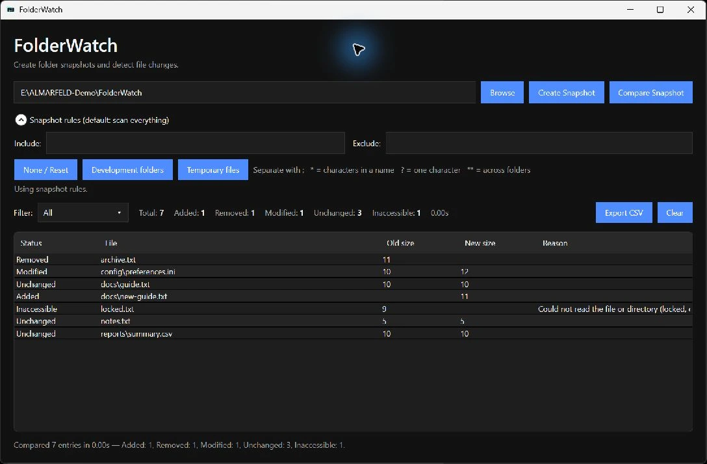

# FolderWatch

FolderWatch is a lightweight, fully offline Windows desktop tool for snapshotting a folder and later detecting what changed in it — files added, removed or modified — using SHA-256 hashing.

## Current release and download

[FolderWatch v1.0.0](https://github.com/AlinTibi/FolderWatch/releases/tag/v1.0.0)
is the current Windows x64 release.

[Download the portable ZIP](https://github.com/AlinTibi/FolderWatch/releases/download/v1.0.0/FolderWatch-v1.0.0-win-x64.zip),
extract it, and run `FolderWatch.exe`. Keep the extracted files together.

## Screenshot



## Features

The source branch prepares **v1.1.0 (unreleased)**. Public downloads above still refer to v1.0.0. See the [release candidate notes](docs/release-notes-v1.1.0.md).

- Select any local folder and create a JSON snapshot of its contents
- Snapshot stores relative path, size, modified time and SHA-256 hash per file
- Compare a saved snapshot against the current folder state
- Detect Added, Removed, Modified, Unchanged and Inaccessible entries, with read-failure diagnostics
- Include/exclude wildcard rules and optional Development/Temporary presets, saved in schema v2 snapshots
- Open and compare old v1.0.0 snapshots; comparison automatically uses their saved scope
- Filter results by status, including Inaccessible
- Cancel snapshot creation/comparison without saving incomplete cancelled output
- Live statistics above the results grid
- Clear results while keeping the selected folder
- Export the filtered results to CSV
- Dark desktop UI, fully offline, no application runtime NuGet dependencies (test packages are development-only)

## Requirements

- Windows 10 or Windows 11 (x64)
- No separate .NET install needed to run the published release — it's self-contained

## Download

Grab the latest portable build from the [Releases page](https://github.com/AlinTibi/FolderWatch/releases/latest):

- `FolderWatch-vX.X.X-win-x64.zip` — unzip and run `FolderWatch.exe`. No installer, no .NET runtime required.

## Usage

1. Select a folder
2. Create a snapshot
3. Later, select the same folder again
4. Compare it against the saved snapshot
5. Filter the results and export them to CSV if needed

For new snapshots, optionally enter semicolon-separated rules: `*.tmp; *.log; bin; obj; .git; node_modules; Thumbs.db`. No preset is selected by default. Names match at any depth; relative paths match from the root. `*` matches within a name, `?` matches one character and `**` spans folders. Exclusions win over includes; empty include means all files. Use **None / Reset** to clear rules. Rules stay in the session and in the snapshot, without storing settings or file contents.

Comparison always uses the snapshot's rules, replacing current session rules with a visible notice. A partial snapshot retains readable files and reports skipped/inaccessible entries. Directory diagnostics protect unknown descendants from false Removed/Added claims. Inaccessible counts can include directories, whose unseen file counts are unknown. Reparse points are skipped with diagnostics to avoid loops and scanning outside the selected root; snapshot files ending in `.folderwatch.json` remain excluded automatically, as in v1.0.0.

CSV exports the current status-filtered rows, sizes, UTC modification times and reasons. Cancel retains previous comparison results and leaves existing snapshot files intact. A snapshot is not a filesystem-wide atomic transaction; detected per-file changes are reported as Inaccessible and should be retried.

## Build from source

Requirements: Windows, .NET 8 SDK.

```powershell
dotnet restore FolderWatch.sln
dotnet build FolderWatch.sln -c Release
dotnet test FolderWatch.sln -c Release
```

To create the local, unpublished v1.1.0 release candidate using the same packaging script as release CI:

```powershell
./scripts/package.ps1 -Tag v1.1.0
```

The ZIP and independently verifiable `.zip.sha256` file are written under `artifacts/rc`. This does not create a Git tag or GitHub release.

## Privacy

FolderWatch runs fully offline. It sends no telemetry, phones home to nothing, and uploads no data — snapshots and comparisons stay on your machine.

## License

MIT License. See [LICENSE](LICENSE).

## Support and security

For software questions, email [support@almarfeld.com](mailto:support@almarfeld.com).
Report reproducible bugs and feature requests in [FolderWatch issues](https://github.com/AlinTibi/FolderWatch/issues).
Do not post private files or credentials in public issues.

Report vulnerabilities privately to [security@almarfeld.com](mailto:security@almarfeld.com).
See [SUPPORT.md](SUPPORT.md) and [SECURITY.md](SECURITY.md).

---

**ALMARFELD** · Independent software development · [almarfeld.com](https://almarfeld.com)

[FolderWatch product page](https://almarfeld.com/software/folderwatch/) ·
[General enquiries](mailto:contact@almarfeld.com) · [MIT license](LICENSE)
